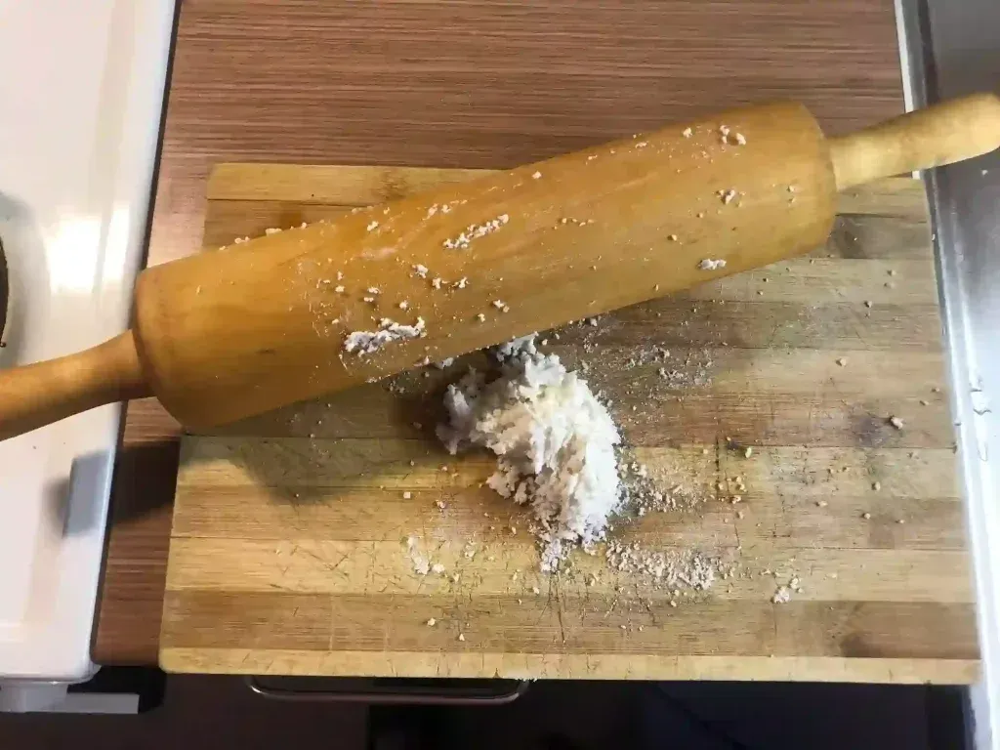

+++
author = "Anonymous"
title = "Ajwain Soup for Abroad Winter"
date = "2024-01-05"
image = "/images/ajwain-broth.webp"
description = "It is recommended to buy awjain seeds from Asian markets for making jwano ko jhol in cold winters of many countries while studying abroad."
tags = [
    "Study in Finland",
]
+++

Ajwain soup (Jwano ko Jhol) is a beloved traditional soup in Nepal that is cherished during cold winters and by women recovering postpartum. This simple ajwain broth is known to soothe indigestion and boost milk production in nursing mothers.
<!--more-->

The soup centers around the warming flavor of ajwain seeds, a staple in Nepali kitchens. It is widely enjoyed by Nepalese both in Nepal and across the diaspora, often sipped from cups or eaten alongside rice.

We hereby share the recipe as prepared by by one of our students.

## Ingredients
- Butter or ghee – 2 tsp
- Turmeric powder – ¼ tsp
- Salt – to taste
- Ajwain (carom) seeds – 2 tsp
- Fenugreek seeds – a few
- Cumin seed powder – ½ tsp
- Garlic paste – 1 tsp
- Ginger paste – ½ tsp
- Rice flour – 1 tsp
- Water – 2 cups

## Method
- Melt the butter or ghee in a deep saucepan over medium heat.
- Add fenugreek and ajwain seeds along with garlic and ginger paste. Sauté until they turn golden brown and release a warm, aromatic scent. Reduce heat to low-medium to avoid burning.
- Stir in rice flour, turmeric, salt, and cumin powder. Cook while stirring for about a minute.
- Gradually whisk in lukewarm water to prevent lumps.
- Bring the mixture to a boil and let it simmer for 2–3 minutes. Optionally, garnish with chopped spring onions before serving.

For Nepalese living abroad, ajwain seeds can usually be found at local Asian or Indian grocery stores.

## Some Tips

- You can use belna chowki (roller and board) for making rice flour from wet rice.

- You can even cook on a normal pan.

