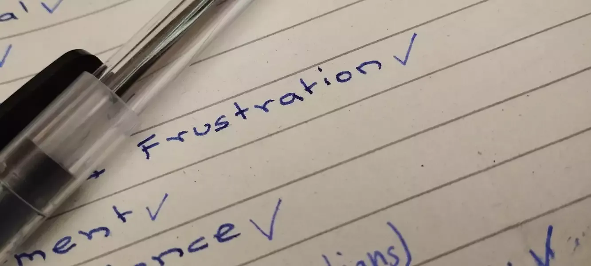

+++
author = "Anonymous"
title = "Emotional Intelligence Simplified"
date = "2019-03-05"
image = "/images/emotional-intelligence.webp"
description = "Sometimes, it is important to sit by oneself and reflect on own’s emotions and habits parallel with life goals and purpose"
tags = [
    "21st century skills",
]
+++

You may be already aware that we are aiming to coach the reader of this article ‘Emotional Intelligence Simplified’ by suggesting ways to keep the balanced emotions in oneself and helping others for the same; and manipulate them in life goals.
<!--more-->

The most popular 4 core skills of emotional intelligence is tabulated below.

| Aspect | Vision | Behavior |
|--------|----------|----------|
| **Ego-centric Pragmatism** | Self-awareness | Self-management |
| **Collective Pragmatism** | Social-awareness | Relationship management |

Human being can not bypass himself / herself from range of emotions since s/he is a social animal. They have different types of situations viz. alone, in group, in the evening, at mid day, during hunger, while eating, while being suggested with corrective measures, while getting applauds, and so on. The physical and social situations also have differential impact on the emotions along the temporal scale.

What goes wrong with human beings is that majority of us may not be able to cope well with the emotions of such range of typologies and variations.

Hence, emotional intelligence has taken the spaces in the coaching modules of counselors of study, work, and life. To work oneself on the domain of emotional intelligence, one first needs to be aware of self- and the other and their emotions of various typologies, ranges, scales and ways to handle resulting least of personal- and communal harm and optimal personal- and social gain.

At the personal level, on must be able to relate one’s emotions with daily situations and life goals. When one is aware of emotions and it’s relevance and impact on the short-term goals and long-term goals, s/he will be easily able to manage themselves in orientations and behaviors.

At social level, they must scale up emotions of themselves empathetically to that of others. Relationship management is the terminology coined to address the need of constructively engaging one’s emotions in day to day dealings and life goals with that of other’s in the social sphere.

## Some Tips on Emotional Intelligence

Listen to others, they are equal human being to you in social situation. Everybody and every opinion has value. If you do not listen, or do not value others and their opinions, you are missing out something in learning for life.

Befriend the ones who are different to you; you will learn more. Difference in nationality, gender, cultural belongingness, religion etc. is, in fact, great resource to learn in the heterogenous world.

Get together with these wonderful people and look for common ground while celebrating diversity. If you disagree, do so without holding any grudges. Disagreement is another opportunity for better learning.

It is more important to improve the life than winning an argument.

Sometimes, it is important to sit by oneself and reflect on own’s emotions and habits parallel with life goals and purpose.

It is also okay to get input from close ones- for example family members and best friends.