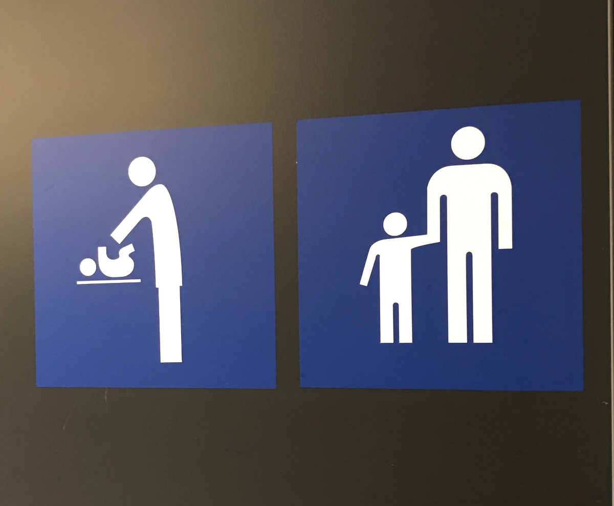

+++
author = "Anonymous"
title = "Parenting and Studying Abroad: Why Leaving Children Behind Isn’t the Best Option"
date = "2020-03-05"
image = "/images/take-children-abroad-study.webp"
description = "The journey of education can—and perhaps should—be shared. Because education is not just about the degree. It’s about growth, togetherness, and building a life enriched by experience, understanding, and love."
tags = [
    "Student Life",
]
+++

"Will you take your partner and kids along with you?"
<!--more-->

This question, though common, carries a deeper concern than it appears on the surface. It subtly challenges the emotional, practical, and moral responsibilities of parenthood. It’s important to recognize that young children have a fundamental right to be with their parents. When one or both parents move abroad to pursue further education, the default consideration should be to bring their children along, not leave them behind.

Taking your family with you is not only a matter of ethics but also a choice with long-term benefits for everyone involved. Children grow and thrive through consistent emotional connection. Being with their parent(s) during a significant transition like studying abroad can positively shape their emotional security, cognitive development, and adaptability. It becomes an adventure for the whole family — a shared experience of learning, resilience, and cross-cultural growth.

Furthermore, risk-taking is an essential life skill, and what better way to cultivate that than by stepping into the unknown together as a family? Children exposed to new environments early in life often develop stronger problem-solving skills, open-mindedness, and emotional flexibility. The entire journey becomes an educational experience not only for the student, but for their partner and children as well.

There are also practical benefits to consider. In many countries like Norway, Sweden, and Finland, partners of international students may be eligible to work full-time, helping support the family financially and integrate into the local community. Some scholarships and government support systems even offer provisions for family members, making it feasible to bring them without overwhelming financial burden.

Of course, moving abroad with a family is not without its challenges—logistics, housing, childcare, and emotional adjustment all come into play. But these are surmountable when approached with the right mindset and guidance. With thorough planning and a strong support network, families not only survive but often flourish in their new environments.

In the end, the question isn’t just “Should I take my family?” It becomes “Why wouldn’t I?” The journey of education can—and perhaps should—be shared. Because education is not just about the degree. It’s about growth, togetherness, and building a life enriched by experience, understanding, and love.