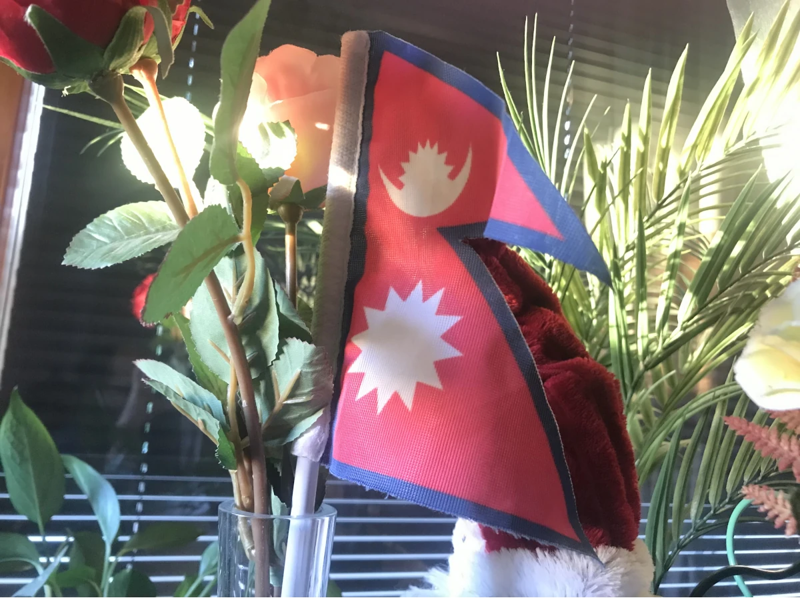
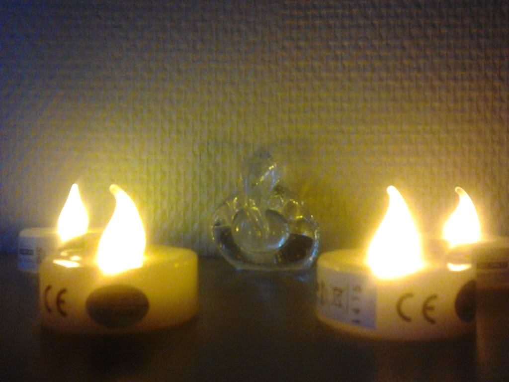

+++
author = "Anonymous"
title = "Do Not Forget to Take Nepali Flag Abroad"
date = "2024-03-05"
image = "/images/national-flag-abroad-study.webp"
description = "To come as handy artifacts in intercultural learning via social events like intercultural dinner, geography quizzes and so on, these flags may serve as important props in making the events as vibrant as they should be."
tags = [
    "Student Life",
]
+++

Ever noticed the background stuffs of your classmate while her/his camera is turned on during the online classes?
<!--more-->

If you are new in this domain of human geography, then you may begin to acknowledge the subtle attempts of an international student normalizing the conflict of being a national of one geography and living in another country. Having a national flag in the personal room is an example of coping with the duality of new geography and having lived most of the life elsewhere.

Not only flag, but people also mostly keep printed family photos, or the ones from the landscape from the home country. Perhaps, the idols of deities may serve as effective source of spiritual balance of such study abroad heroes.

To come as handy artifacts in intercultural learning via social events like intercultural dinner, geography quizzes and so on, these flags may serve as important props in making the events as vibrant as they should be.

